# Basic Knowledge Quiz

This is a quiz game for people who like to test there general knowledge
or just for people who want to enjoy playing a game of quiz! The quiz contains different questions about all types of different subjects.
The quiz Basic Knowledge Quiz runs in the python terminal and in the heroku application.
The quiz collect questions and answers from a Google Sheets named basic_questions. The "questions sheet" contains the questions and answers, and the "score sheet" contains the score results.

Here is the link to the [Game](https://basic-knowledge-quiz-aa6b69fbaded.herokuapp.com/)

Score and questions [Here](https://docs.google.com/spreadsheets/d/1QgQxf4szI-pQVZOtIcsYs-hHA5RUfSupCR758wEnRe4/edit#gid=0)

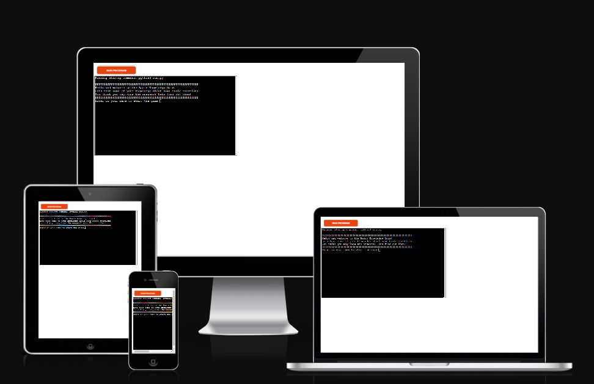
from the https://ui.dev/amiresponsive

## How to play the game

* When the game starts you have to type in a player name.
* Then the game will start and show you the first question out of 10.
* When you type in your answer you will get a point if you are right, if wrong you get none.
* When the game is done you will see your score out of the 10 questions.
* And you get the choice to try again or to end the game.
* And the score and user name will be uploaded to the google sheet. 

## Features

### Existing features in the game

* Start of the game user need to choose a name.
* it has to be a name(not numbers or blank).

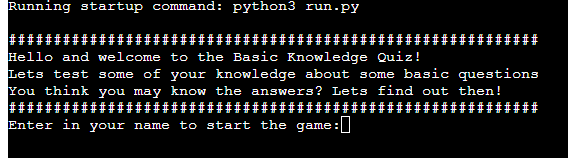

* Here the user need to enter in a answer to the question.
* The answers can't be blank or else it will ask for an answer again.

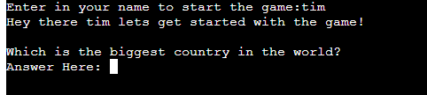

* If the answer is right the terminal will show the user a text that its the right answer.
* And it will save one score for the user.

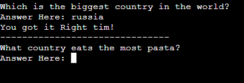

* If the answer is wrong the user will get the text that will say its wrong.
* It will move on to the next question.
* It will show the answer to the question.
* And the user will get no score.

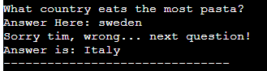

* When the game is done the terminal will show a text with the users score out of 10.
* Game over.

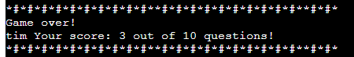

* The user will get a chance to play once more or end the quiz game.

 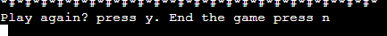

 * If the user decide to leave the game and press n the game is over.

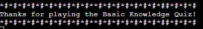

* If the user want to play again and press y, the game will restart.

* The questions and answers is in a google sheet named basic_questions
* The score for the user is in the same google sheet basic_questions

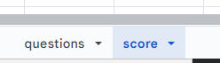

* The score will be uploaded to the google sheet in the sheet "score".

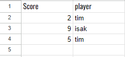

* And the questions is collected from the google sheet "questions".

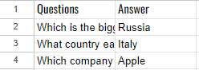

### Features to implement later

* Alternative to different quiz in another google sheets after the first one is done.

## Testing the game 

- The game have been tested in the https://pep8ci.herokuapp.com/# and did not find any problem.

- Tested for different inputs for user name. no blank spaces or numbers can be used.

- The game is working in my terminal on gitpod and it works on the heroku terminal aswell.

- Score is always uploaded from the user to the google sheet after the game is completed.

## Bugs

### bugs solved 
* score_number was on the bottom of the function start_game_again. So it was moved to the if statment if user want to play again the score returns to 0.

### bugs left
* No bugs left in the game.

### Python validator test

- tested code in the https://www.pythonchecker.com/ validator and no errors found.

## Deployment

- Deployment was made via code institute to heroku.

#### steps 
- created a new app on heroku and selected which region.

-  into settings and scrolled to the Config Vars and put in the key and value of the creds file in the project.
- and down one step to Buildpacks and then press Add Buildpacks, python first then nodejs.
- back up to settings and to the left is Deploy
- press Deploy and go to Deployment method and choose Connect to GitHub
- then search for the repository to connect to.
- then connect to it.
- down to Manual deploy and Deploy a GitHub branch and press deploy branch

## Credits
- Code institute love sandwiches project how to get the API to google sheets and heroku.
- Wikipedia for all the game questions and answers.
- https://docs.gspread.org/en/v6.0.0/index.html for help to reach and upload to google sheet.
- https://www.w3schools.com/python/
- https://www.pythontutorial.net/python-built-in-functions/python-zip/ iterating 2 list at the same time.

